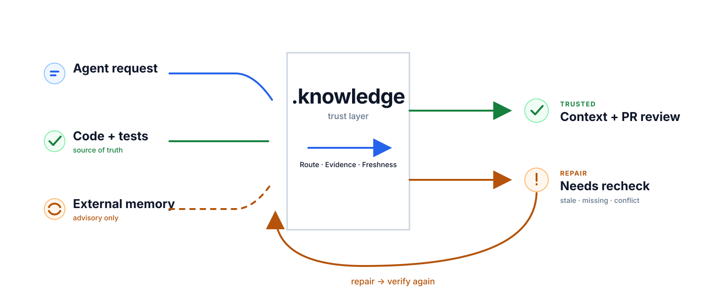

# .knowledge by Pro2Pilot

<p align="center">
  
</p>

<p align="center"><strong>The open, repo-local trust layer for AI coding agents.</strong></p>

AI coding agents move fast. The hard part is knowing **what they should trust**.

`.knowledge` gives Codex, Claude Code, OpenCode, Gemini CLI, GitHub Copilot, Devin/Windsurf, Continue, Roo Code, Aider, and custom agents a shared system for:

```txt
routing -> evidence -> trust + freshness -> repair -> PR review
```

Current code and tests remain the source of truth. Stale summaries, low-confidence notes, and external memory are never silently treated as facts.

> AI adoption is already mainstream. Trust is not. In the [2025 Stack Overflow Developer Survey](https://survey.stackoverflow.co/2025/ai), 84% of respondents use or plan to use AI tools, while 46% distrust their accuracy.

## What `.knowledge` changes

- **Routes agents before they crawl.** One first-read bundle points each agent to the relevant modules, files, and source-of-truth order.
- **Makes knowledge evidence-backed.** Claims can be traced to current code, tests, and explicit evidence.
- **Detects stale or suspect context.** Freshness and trust state are visible before an agent relies on old summaries or memory.
- **Restores trust instead of hiding drift.** A repair queue explains what broke, what changed, and what needs to be rechecked.
- **Turns changes into reviewer-ready impact.** PR review connects changed files to modules, critical paths, trust, evidence, and recommended checks.
- **Shows the system locally.** The free Visual Inspector makes trust, freshness, repair, PR impact, and agent activity understandable without reading raw JSON.

`.knowledge` is not an AI IDE and does not replace your agents. Agents execute work; `.knowledge` makes the knowledge around that work inspectable, fresh, repairable, and reviewable.

### Local-first by design

```txt
Apache-2.0 open core
no required cloud
no required login
no telemetry
works with multiple coding agents
external memory stays advisory
```

## Start

> **Install note:** Do not use GitHub "Download ZIP" as the install package. Use the release asset only. Canonical asset: `knowledge-v3.2.0.zip` from https://github.com/pro2pilot/knowledge/releases/tag/v3.2.0

Extract the release so your repository contains `.knowledge/`, then tell your agent:

```txt
Read `.knowledge/Quick-Start.md` and execute it for this repository.
```

Or run manually:

```bash
node .knowledge/tools/install-check.js --json
node .knowledge/tools/install-agent-integrations.js --runtime codex
node .knowledge/tools/flow.js import
node .knowledge/inspector.js
```

After setup, the first operational file an agent reads is:

```txt
.knowledge/maintenance/routing_bundle.json
```

## What it does

- Writes and refreshes the first-read routing bundle in `.knowledge/maintenance/routing_bundle.json`.
- Stores module cards, decisions, evidence, wiki notes, and handoff state beside the code.
- Builds a local search index and typed wiki graph for targeted context discovery.
- Generates doctor reports, metrics, PR summaries, and Mermaid flow diagrams.
- Provides official templates, GitHub Action templates, and runtime-specific integrations for popular coding agents.
- Keeps optional memory providers as advisory context, never as a source of truth.

## Official templates

`.knowledge` includes official template packs for common project shapes:

```txt
templates/official/nextjs-saas
templates/official/python-fastapi
templates/official/node-monorepo
templates/official/supabase
templates/official/ai-agent-runtime
```

List and apply templates:

```bash
node .knowledge/tools/apply-template.js --list
node .knowledge/tools/apply-template.js nextjs-saas
```

Templates are advisory. They add review hints, wiki notes, and repair queue items, but they do not claim that a project has already been verified.

## Visual Inspector

Build the static inspector:

```bash
node .knowledge/tools/build-visual-inspector.js
```

Open:

```txt
.knowledge/inspector/index.html
```

It shows health, trust buckets, modules, repair queue, stale items, critical files, wiki graph, applied templates, and Memory Providers state. Use it for screenshots, demos, onboarding, and debugging.

The bundled Visual Inspector is local, static and free.

For teams that need interactive graphs, advanced filters, repair queue views, PR impact, policy overlays and multi-repo dashboards, join the Pro2Pilot Inspector waitlist:

https://pro2pilot.com/inspector/

## Cookbook

Practical recipes live in:

```txt
.knowledge/docs/cookbook/
```

Current recipes cover new project setup, existing-project migration, agent handoff, wiki graph maintenance, PR review, and memory providers.

## Source-of-truth order

```txt
current code
> current tests
> .knowledge/evidence/*.json
> .knowledge/modules/*.json
> .knowledge/decisions.json
> .knowledge/wiki/*.md
> .knowledge/sessions/*
> external retrieved memory
```

Code beats summaries. Tests beat prose. External memory is retrieved advisory context only.

## Evidence and benchmarks

Measured carefully. No magic claims.

These numbers come from a **synthetic SaaS fixture** and a few small synthetic repos, on a single local machine. They are **order-of-magnitude** results from one local token estimator (`max(ceil(words*1.33), ceil(chars/4))`). They are not production benchmarks, they are not tokenizer-verified, and they are not a guarantee of behavior on your repo.

On the synthetic SaaS-shape fixture, `.knowledge` reduced the orientation path from 14 files to one routing bundle. On tiny synthetic repos, the routing bundle has fixed structural cost and the percentage may go negative -- this is reported honestly, not hidden.

Doctor scores in smoke scenarios ranged **healthy 90-93 depending on scenario**. Remaining deductions are intentional low-trust / suspect-module warnings from heuristic ingest; source-backed evidence is required before trust is raised.

### What these numbers mean

- A no-`.knowledge` agent has to open multiple manifests and crawl source folders to identify domain areas. The routing bundle replaces that for the agent's first read.
- On the SaaS fixture, `14 files -> 1 routing bundle` is the headline change. Token counts are estimates, not exact.
- Doctor and wiki-lint scores reflect structural health of `.knowledge`, not correctness of the user's code.

### What these numbers do not prove

- They do not prove a uniform speedup across all repos. Tiny repos may show overhead because the routing bundle has fixed structure cost.
- They are not equivalent to a real tokenizer count. Production tokenizers will differ.
- They are not a guarantee of agent behavior -- agents may still ignore routing if instructed to read source directly.

Benchmark methodology is summarized in:

```txt
.knowledge/docs/metrics-benchmarks.md
```

Regenerate project-specific numbers with:

```bash
node .knowledge/tools/flow.js release --no-color
```

## Quickstart

There are three supported paths. Do not copy a source checkout into
`.knowledge/`; use the release artifact or the updater command.

### Fresh install

Extract the archive into the repository root so it creates:

```txt
.knowledge/
```

Then give the agent:

```txt
Read `.knowledge/Quick-Start.md` and execute it for this repository.
```

Manual setup:

```bash
node .knowledge/tools/install-check.js --json
node .knowledge/tools/install-agent-integrations.js --runtime codex
node .knowledge/tools/flow.js import
node .knowledge/inspector.js
```

Replace `codex` with `claude`, `opencode`, `gemini`, `copilot`, `devin`, `windsurf`, `continue`, `roo`, or `aider` when that is the active agent. Use `--all` only when you intentionally want every supported integration surface.

Before `flow import`, project runtime files such as `project_index.json`,
`freshness.json`, and `maintenance/routing_bundle.json` may not exist yet.
That is expected for the public install archive. After `flow import`,
`maintenance/routing_bundle.json` becomes the first operational read.

Release/readiness check:

```bash
node .knowledge/tools/flow.js release
```

### Existing `.knowledge` update

Download the new release artifact, extract it into a temporary folder, then
update only system/framework files:

```bash
node .knowledge/tools/update-system-files.js --from <new-knowledge-root> --dry-run
node .knowledge/tools/update-system-files.js --from <new-knowledge-root> --apply --yes
```

The updater preserves project knowledge such as `wiki/`, `modules/`,
`evidence/`, `decisions.json`, `maintenance/`, `maps/`, `sessions/`, and
runtime trust state.

### Migration from non-`.knowledge`

Back up the existing knowledge source, preserve the raw source as advisory
material, import only mapped content, and then run:

```bash
node .knowledge/tools/flow.js import
```

Imported material starts as advisory context until checked against current code
and tests.

## Main commands

```bash
node .knowledge/tools/doctor.js
node .knowledge/tools/install-check.js --json
node .knowledge/tools/update-system-files.js --from <new-knowledge-root> --dry-run
node .knowledge/tools/git-policy.js --json
node .knowledge/tools/flow.js scan
node .knowledge/tools/flow.js lint
node .knowledge/tools/flow.js import
node .knowledge/tools/flow.js release
node .knowledge/tools/flow.js release --no-color
node .knowledge/tools/check-updates.js              # manual update check
node .knowledge/tools/search-knowledge.js "query"
node .knowledge/tools/search-knowledge.js "query" --scope=templates
node .knowledge/tools/search-knowledge.js "query" --scope=cookbook
node .knowledge/tools/search-knowledge.js "query" --scope=all
node .knowledge/tools/collect-metrics.js
node .knowledge/tools/build-visual-inspector.js
node .knowledge/inspector.js
```

## Concurrent agent work

Concurrent agent work is explicit. It lets multiple agents work in separate Git worktrees or
branches while runtime state stays separated under a shared team root.

```bash
node .knowledge/tools/team-init.js --team-root ../.knowledge-team --target-root . --json
node .knowledge/tools/workspace-register.js --team-root ../.knowledge-team --target-root ../worktrees/codex-task-1 --workspace-id codex-task-1 --agent-id codex-01 --json
node .knowledge/tools/flow.js release --team-root ../.knowledge-team --target-root ../worktrees/codex-task-1 --workspace-id codex-task-1 --agent-id codex-01 --exclusive --json
node .knowledge/tools/team-pr-summary.js --team-root ../.knowledge-team --workspace-id codex-task-1 --json
node .knowledge/tools/team-status.js --team-root ../.knowledge-team --json
```

Curated knowledge stays branch-local in Git. Generated/runtime state is written
to `<teamRoot>/repos/<repoId>/workspaces/<workspaceId>/state/`.

See `.knowledge/docs/cookbook/07-team-worktree-pr.md`.

Source maintainers can build a safe install artifact with:

```bash
node tools/package-release.js
```

The output is `dist/knowledge-v<version>.zip` with `.knowledge/` as the archive
root and no nested `.knowledge/.git`.

## Additional workflows

### Cookbook docs

See:

```txt
.knowledge/docs/cookbook/
```

The cookbook is the practical recipe layer for `.knowledge`. It is a set of short operational playbooks that tell an agent exactly when to use a workflow, which files to read first, which commands to run, which artifacts to update, and what to verify before trusting the result.

### Graph execution visualization

```bash
node .knowledge/tools/render-graph-execution.js
```

Outputs Mermaid diagrams to:

```txt
.knowledge/maintenance/graphs/knowledge-flow.mmd
.knowledge/maintenance/graphs/maintenance-flow.mmd
.knowledge/maintenance/graphs/agent-handoff-flow.mmd
```

### GitHub Actions and PR summaries

Templates live in:

```txt
.knowledge/github-action-templates/
```

These templates are inactive until copied to `.github/workflows/`. Start with `knowledge-health.yml`.

Generate a PR-facing summary:

```bash
node .knowledge/tools/generate-pr-summary.js
```

Output:

```txt
.knowledge/maintenance/pr_summary.md
```

### Inspector and screenshots

The inspector is optional. `.knowledge` works without it.

```bash
node .knowledge/tools/build-visual-inspector.js
node .knowledge/inspector.js
```

Details: `.knowledge/docs/inspector.md`.

### Metrics and benchmarks

```bash
node .knowledge/tools/collect-metrics.js
```

Outputs:

```txt
.knowledge/metrics/baseline.json
.knowledge/metrics/README.md
```

### Migration docs and maintenance flows

- `.knowledge/docs/migration.md`
- `.knowledge/flows/*.md`
- `.knowledge/tools/flow.js`

### Git policy

Read:

```txt
.knowledge/docs/git-policy.md
```

The default policy commits curated/system and project knowledge, but ignores
runtime locks, logs, temp files, search indexes, inspector data, flow logs, and
generated heavy outputs unless the team explicitly force-adds them.

## Updates

`.knowledge` does not run a background updater, does not apply updates silently, and does not send telemetry. Visual Inspector checks the official release feed when it opens and offers an explicit update flow.

Check manually:

```bash
node .knowledge/tools/check-updates.js
```

Keep or re-enable weekly advisory checks during `doctor` / `flow`:

```bash
node .knowledge/tools/check-updates.js --enable --interval=7d
```

Change the interval:

```bash
node .knowledge/tools/check-updates.js --interval=14d
```

Disable update checks:

```bash
node .knowledge/tools/check-updates.js --disable
```

Update checks only query GitHub Releases for the official `pro2pilot/knowledge` repository. They never upload repository content, never auto-update files, and never overwrite project knowledge records. When an update is available, use Visual Inspector or `update-system-files.js` to copy system files, create missing migration defaults, preserve curated knowledge, and write a preservation proof.

## Memory providers

Mem0 OSS is the recommended optional universal memory backend for free/core. Pinecone remains optional as a vector/cloud retrieval bridge. Both are disabled by default and advisory only.

```txt
Mem0 OSS        -> recommended optional local memory backend
Pinecone Local  -> local emulator / CI / experiments
Pinecone Cloud  -> managed vector database
```

Check local readiness:

```bash
node .knowledge/tools/memory-provider.js status-all --json
node .knowledge/tools/memory-mem0.js health --json
node .knowledge/tools/memory-mem0.js health --adapter live --json
```

The live Mem0 health check uses bounded Python discovery: explicit `--python`, `KNOWLEDGE_MEM0_PYTHON`/`MEM0_PYTHON`, active virtual environments, PATH commands, Windows `py`/`pymanager` listings, and standard Python install directories. It does not scan the whole disk and never installs Python or Mem0 automatically. Only `health --adapter live` uses a 30000 ms default timeout for the live Mem0 import/health path, because the first `import mem0` on Windows can be noticeably slower than warm checks; short Python discovery/probe checks stay short. If that wait is exceeded, JSON reports `diagnostic_code: python_timeout`. Use `--timeout-ms <ms>` to override the live health wait; Python probe/import overrides also accept `--python-timeout-ms <ms>` and the compatibility alias `--pythonTimeMs <ms>`. If Python is found but Mem0 is missing, the output includes the exact `<python> -m pip install mem0ai==2.0.4` command. If live writes/searches hit a qdrant lock or storage permission failure, JSON reports `diagnostic_code: mem0_storage_permission_error` without deleting locks or repairing permissions.

External retrieved chunks never override source code, tests, evidence, or decisions. Claude MEM is no longer a first-class provider; legacy artifacts are migration-only advisory data.

### Release artifact and Inspector

> **Install note:** Do not use GitHub "Download ZIP" as the install package. Use the release asset only.

Use `dist/knowledge-v3.2.0.zip` as the install artifact. Do not copy the source checkout into `.knowledge/`.

```bash
node tools/package-release.js
node tools/validate-release-artifact.js dist/knowledge-v3.2.0.zip --json
```

Build the local tabbed Inspector after install/import:

```bash
node .knowledge/tools/build-visual-inspector.js
```

Free Inspector is local and command-copy by default. Pro Inspector is a separate paid app for PR impact, repair ownership, policy packs, memory governance, provider fleet status, multi-repo/team dashboard, and audit/history.

## Repository health check

Run when you want to refresh public-facing local artifacts:

```bash
node .knowledge/tools/flow.js release
```

## License

The open-core `.knowledge` distribution in this archive is licensed under the Apache License, Version 2.0. See [`LICENSE`](./LICENSE) and [`NOTICE`](./NOTICE).

This Apache-2.0 license applies to the contents shipped in this `.knowledge` archive unless a file explicitly states otherwise.
