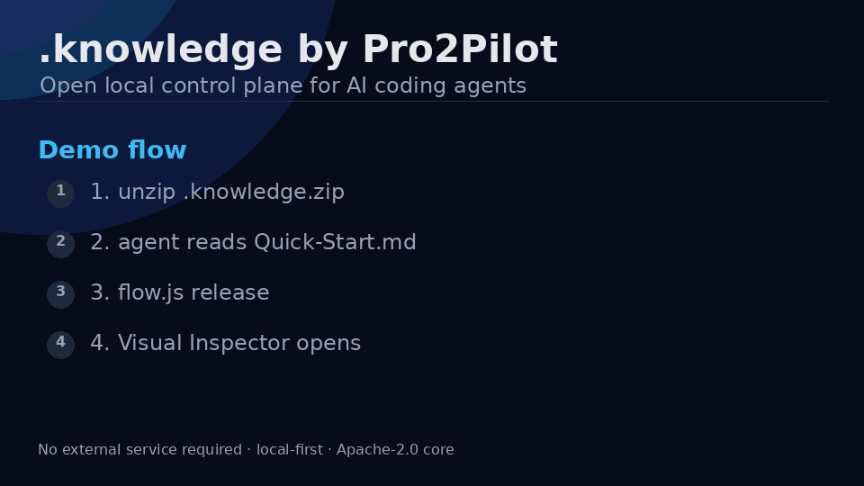

# .knowledge by Pro2Pilot

<p align="center">
  
</p>

**Stop paying agents to rediscover your repo.**

`.knowledge` gives Codex, Claude Code, OpenCode and custom agents a local control plane for the repository: one first-read routing bundle, trust and freshness status, repair queue, scoped local search, source-of-truth rules and a Visual Inspector.

**Synthetic SaaS-shape fixture:** **14 orientation files → 1 routing bundle**, **~22% less first-orientation context**.

**Fewer repeated repo crawls. Fewer stale-summary mistakes. Fewer wrong-file loops.**

Different agents, same repo, shared project memory — without forcing them into one chat thread.

- One first-read routing bundle
- Trust and freshness status
- Repair queue
- Local search scopes
- Source-of-truth order
- Multi-agent workflow for Codex, Claude Code, OpenCode and custom agents
- Visual Inspector
- Local-first, no telemetry
- No required cloud

For a fresh archive, first-time setup starts with:

```txt
Read `.knowledge/Quick-Start.md` and execute it for this repository.
```

Manual first-time setup:

```bash
node .knowledge/tools/install-agent-integrations.js
node .knowledge/tools/flow.js import
```

After setup, the first operational file an agent reads is:

```txt
.knowledge/maintenance/routing_bundle.json
```

## What it does

- Routes agents to the right modules and files.
- Tracks trust levels and freshness.
- Marks stale or suspect knowledge instead of silently trusting it.
- Stores module cards, decisions, evidence, wiki notes, and handoff state.
- Builds a local search index and typed wiki graph.
- Generates doctor reports, metrics, PR summaries, and Mermaid flow diagrams.
- Provides GitHub Action templates and agent integrations.
- Supports optional external memory as a bridge, not a source of truth.

## Official templates

`.knowledge` includes official template packs for common project shapes:

```txt
templates/official/nextjs-saas
templates/official/python-fastapi
templates/official/node-monorepo
templates/official/supabase
templates/official/ai-agent-runtime
```

List and apply templates:

```bash
node .knowledge/tools/apply-template.js --list
node .knowledge/tools/apply-template.js nextjs-saas
```

Templates are advisory. They add review hints, wiki notes, and repair queue items, but they do not claim that a project has already been verified.

## Visual Inspector

Build the static inspector:

```bash
node .knowledge/tools/build-visual-inspector.js
```

Open:

```txt
.knowledge/inspector/index.html
```

It shows health, trust buckets, modules, repair queue, stale items, critical files, wiki graph, applied templates, and external-memory state. Use it for screenshots, demos, onboarding, and debugging.

The bundled Visual Inspector is local, static and free.

For teams that need interactive graphs, advanced filters, repair queue views, PR impact, policy overlays and multi-repo dashboards, join the Pro2Pilot Inspector waitlist:

https://pro2pilot.com/inspector/

## Cookbook

Practical recipes live in:

```txt
.knowledge/docs/cookbook/
```

Current recipes cover new project setup, existing-project migration, agent handoff, wiki graph maintenance, PR review, and external memory.

## Smoke benchmark

These numbers come from a **synthetic SaaS fixture** and a few small synthetic repos, on a single local machine. They are **order-of-magnitude** results from one local token estimator (`max(ceil(words*1.33), ceil(chars/4))`). They are not production benchmarks, they are not tokenizer-verified, and they are not a guarantee of behavior on your repo.

On the synthetic SaaS-shape fixture, `.knowledge` reduced the orientation path from 14 files to one routing bundle. On tiny synthetic repos, the routing bundle has fixed structural cost and the percentage may go negative — this is reported honestly, not hidden.

Doctor scores in smoke scenarios ranged **healthy 90–93 depending on scenario**. Remaining deductions are intentional low-trust / suspect-module warnings from heuristic ingest; source-backed evidence is required before trust is raised.

### What these numbers mean

- A no-`.knowledge` agent has to open multiple manifests and crawl source folders to identify domain areas. The routing bundle replaces that for the agent's first read.
- On the SaaS fixture, `14 files → 1 routing bundle` is the headline change. Token counts are estimates, not exact.
- Doctor and wiki-lint scores reflect structural health of `.knowledge`, not correctness of the user's code.

### What these numbers do not prove

- They do not prove a uniform speedup across all repos. Tiny repos may show overhead because the routing bundle has fixed structure cost.
- They are not equivalent to a real tokenizer count. Production tokenizers will differ.
- They are not a guarantee of agent behaviour — agents may still ignore routing if instructed to read source directly.

Benchmark methodology is summarized in:

```txt
.knowledge/docs/metrics-benchmarks.md
```

Regenerate project-specific numbers with:

```bash
node .knowledge/tools/flow.js release --no-color
```

## Source-of-truth order

```txt
current code
> current tests
> .knowledge/evidence/*.json
> .knowledge/modules/*.json
> .knowledge/decisions.json
> .knowledge/wiki/*.md
> .knowledge/sessions/*
> external retrieved memory
```

Code beats summaries. Tests beat prose. External memory is retrieved context only.

## Quickstart

Extract the archive into the repository root so it creates:

```txt
.knowledge/
```

Then give the agent:

```txt
Read `.knowledge/Quick-Start.md` and execute it for this repository.
```

Manual setup:

```bash
node .knowledge/tools/install-agent-integrations.js
node .knowledge/tools/flow.js import
```

Before `flow import`, project runtime files such as `project_index.json`,
`freshness.json`, and `maintenance/routing_bundle.json` may not exist yet.
That is expected for the public install archive. After `flow import`,
`maintenance/routing_bundle.json` becomes the first operational read.

Release/readiness check:

```bash
node .knowledge/tools/flow.js release
```

## Main commands

```bash
node .knowledge/tools/doctor.js
node .knowledge/tools/flow.js scan
node .knowledge/tools/flow.js lint
node .knowledge/tools/flow.js import
node .knowledge/tools/flow.js release
node .knowledge/tools/flow.js release --no-color
node .knowledge/tools/check-updates.js              # manual update check
node .knowledge/tools/search-knowledge.js "query"
node .knowledge/tools/search-knowledge.js "query" --scope=templates
node .knowledge/tools/search-knowledge.js "query" --scope=cookbook
node .knowledge/tools/search-knowledge.js "query" --scope=all
node .knowledge/tools/collect-metrics.js
node .knowledge/tools/build-visual-inspector.js
node .knowledge/tools/serve-inspector.js
```

## Additional workflows

### Cookbook docs

See:

```txt
.knowledge/docs/cookbook/
```

The cookbook is the practical recipe layer for `.knowledge`. It is a set of short operational playbooks that tell an agent exactly when to use a workflow, which files to read first, which commands to run, which artifacts to update, and what to verify before trusting the result.

### Graph execution visualization

```bash
node .knowledge/tools/render-graph-execution.js
```

Outputs Mermaid diagrams to:

```txt
.knowledge/maintenance/graphs/knowledge-flow.mmd
.knowledge/maintenance/graphs/maintenance-flow.mmd
.knowledge/maintenance/graphs/agent-handoff-flow.mmd
```

### GitHub Actions and PR summaries

Templates live in:

```txt
.knowledge/github-action-templates/
```

These templates are inactive until copied to `.github/workflows/`. Start with `knowledge-health.yml`.

Generate a PR-facing summary:

```bash
node .knowledge/tools/generate-pr-summary.js
```

Output:

```txt
.knowledge/maintenance/pr_summary.md
```

### Inspector and screenshots

The inspector is optional. `.knowledge` works without it.

```bash
node .knowledge/tools/build-visual-inspector.js
node .knowledge/tools/serve-inspector.js
```

Details: `.knowledge/docs/inspector.md`.

### Metrics and benchmarks

```bash
node .knowledge/tools/collect-metrics.js
```

Outputs:

```txt
.knowledge/metrics/baseline.json
.knowledge/metrics/README.md
```

### Migration docs and maintenance flows

- `.knowledge/docs/migration.md`
- `.knowledge/flows/*.md`
- `.knowledge/tools/flow.js`

## Updates

`.knowledge` does not run a background updater and does not send telemetry. Update checks are disabled by default.

Check manually:

```bash
node .knowledge/tools/check-updates.js
```

Enable optional weekly advisory checks during `doctor` / `flow`:

```bash
node .knowledge/tools/check-updates.js --enable --interval=7d
```

Change the interval:

```bash
node .knowledge/tools/check-updates.js --interval=14d
```

Disable update checks:

```bash
node .knowledge/tools/check-updates.js --disable
```

Update checks only query GitHub Releases for the official `pro2pilot/knowledge` repository. They never upload repository content, never auto-update files, and never overwrite project knowledge records.

## External memory

Pinecone is optional and disabled by default. It can be used as a cold archive bridge in two modes:

```txt
Pinecone Local  → local emulator / CI / experiments
Pinecone Cloud  → managed vector database
```

Check local readiness:

```bash
node .knowledge/tools/external-memory-status.js
```

External retrieved chunks never override source code, tests, evidence, or decisions.

## Repository health check

Run when you want to refresh public-facing local artifacts:

```bash
node .knowledge/tools/flow.js release
```

## License

The open-core `.knowledge` distribution in this archive is licensed under the Apache License, Version 2.0. See [`LICENSE`](./LICENSE) and [`NOTICE`](./NOTICE).

This Apache-2.0 license applies to the contents shipped in this `.knowledge` archive unless a file explicitly states otherwise.
