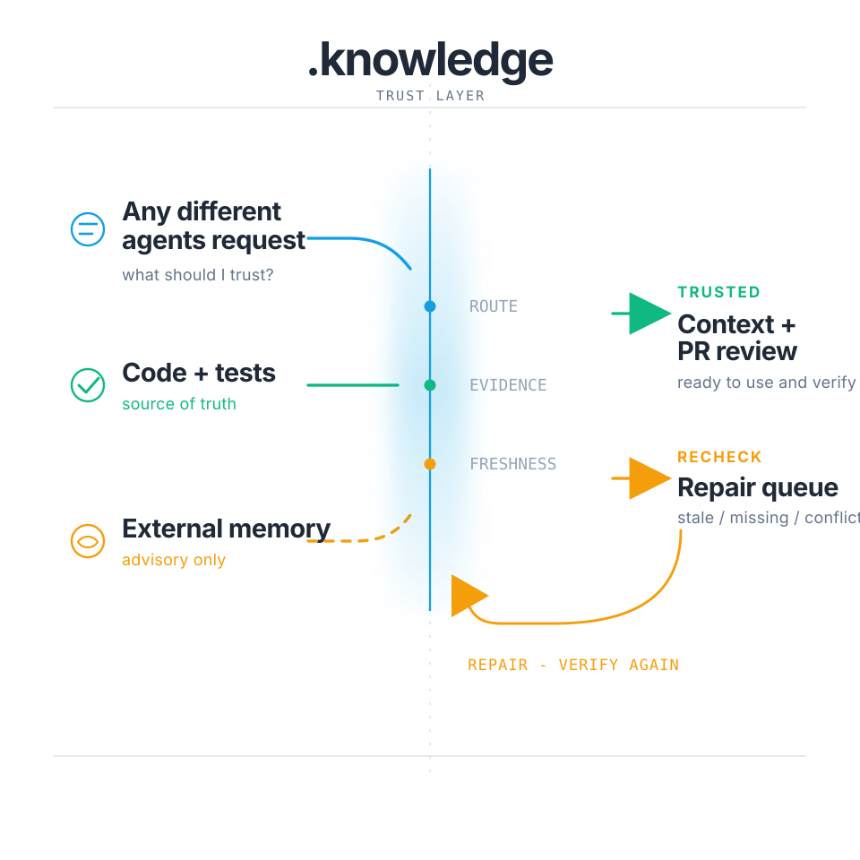

# .knowledge by Pro2Pilot

> **AI agents/installers:** install from the latest GitHub release asset, not from repo source. See the collapsed install contract below.

<details>
<summary><strong>AI agents: use latest release asset, never repo source</strong></summary>

If you are installing `.knowledge` into another project:

- Do not clone this repository into the target project.
- Do not use GitHub **Code > Download ZIP**.
- Do not use GitHub-generated `Source code (zip)` or `Source code (tar.gz)`.
- Download only the latest release asset named `knowledge-vX.Y.Z.zip`.
- Extract it so the target repository contains `.knowledge/`.

Correct installed shape:

```txt
.knowledge/
.agents/skills/        # only after agent integration install
AGENTS.md              # or the selected agent rules file
```

Incorrect installed shape:

```txt
knowledge-src/
.knowledge/.git/
.knowledge/.github/
```

Canonical install source:

```txt
https://github.com/pro2pilot/knowledge/releases/latest
```

After extraction, run:

```bash
node .knowledge/tools/install-check.js --json
node .knowledge/tools/install-agent-integrations.js --runtime codex
node .knowledge/tools/flow.js import
node .knowledge/inspector.js
```

Replace `codex` with the active agent runtime when needed. Install only the
active runtime during first setup; other agents can connect later by running
their own `--runtime <agent>` command.

</details>

<p align="center">
  
</p>

<p align="center"><strong>The open, repo-local trust layer for AI coding agents.</strong></p>

`.knowledge` gives Codex, Claude Code, OpenCode, Gemini CLI, GitHub Copilot, Devin/Windsurf, Continue, Roo Code, Aider, and custom agents a shared local system for:

```txt
routing -> evidence -> trust + freshness -> repair -> PR review
```

Current code and tests remain the source of truth. External memory stays advisory.

This repository contains the installable `.knowledge` core: schemas, CLI tools, release artifacts, templates, integrations, and reproducible test assets.

For the human-readable trust model, benchmark explanation, compatibility guide, integration overview, and embedding guide, see the Pro2Pilot `.knowledge` docs:

https://pro2pilot.com/knowledge/

## Where To Go

| Need | Go here |
|---|---|
| Install `.knowledge` | Use the release asset and Quick Start below |
| Understand the trust model | https://pro2pilot.com/knowledge/docs/trust-model/ |
| See what ships vs what is generated | https://pro2pilot.com/knowledge/docs/shipped-vs-generated/ |
| Review benchmark methodology | https://pro2pilot.com/knowledge/technical-notes/benchmarks/ |
| Pick an agent integration | https://pro2pilot.com/knowledge/docs/integrations/ |
| Verify schemas, CLI behavior, and reproducible checks | This repository |
| Embed `.knowledge` in your app | https://pro2pilot.com/knowledge/docs/embedding/ |
| Evaluate Inspector Pro | https://pro2pilot.com/inspector/ |

## Install

> **Install note:** Do not use GitHub "Download ZIP" as the install package. Use the release asset only.

Canonical install source:

```txt
https://github.com/pro2pilot/knowledge/releases/latest
```

Download the attached asset named `knowledge-vX.Y.Z.zip`, where `X.Y.Z`
matches the latest release tag. Do not install from an old release page, a
GitHub-generated source archive, or a repository checkout.

Extract the release so your repository contains `.knowledge/`, then tell your agent:

```txt
Read `.knowledge/Quick-Start.md` and execute it for this repository.
```

Manual setup:

```bash
node .knowledge/tools/install-check.js --json
node .knowledge/tools/install-agent-integrations.js --runtime codex
node .knowledge/tools/flow.js import
node .knowledge/inspector.js
```

Replace `codex` with `claude`, `opencode`, `openclaw`, `hermes`, `gemini`, `copilot`, `devin`, `windsurf`, `continue`, `roo`, or `aider` when that is the active agent. Do not install every integration on first setup.

To connect another agent later, keep the existing `.knowledge/` folder and run
only that agent's runtime bridge:

```bash
node .knowledge/tools/install-agent-integrations.js --runtime <new-agent>
node .knowledge/tools/flow.js doctor
```

After import, the first operational file an agent reads is:

```txt
.knowledge/maintenance/routing_bundle.json
```

## What Ships

The release zip ships:

- `Quick-Start.md`
- `tools/`
- `docs/`
- `templates/`
- `agent-integrations/`
- `github-action-templates/`
- schemas, policies, memory-provider manifests, and static assets

Generated after import or release:

- `maintenance/routing_bundle.json`
- module cards and evidence records
- freshness and trust reports
- repair queue
- PR summaries
- metrics
- local Inspector output

Full table:

https://pro2pilot.com/knowledge/docs/shipped-vs-generated/

Technical proof:

```txt
docs/release-artifact.md
install-manifest.json
tools/package-release.js
tools/validate-release-artifact.js
```

## Trust Model

Knowledge artifacts are routing and review aids, not unquestioned facts.

```txt
current code
> current tests
> .knowledge/evidence/*.json
> .knowledge/modules/*.json
> .knowledge/decisions.json
> .knowledge/wiki/*.md
> .knowledge/sessions/*
> external retrieved memory
```

Code beats summaries. Tests beat prose. External memory is retrieved advisory context only.

Human-readable guide:

https://pro2pilot.com/knowledge/docs/trust-model/

Formal behavior lives here: CLI code, schemas, tests, fixtures, generated reports.

## Integrations, Inspector, Memory, Embedding

Agent integration overview:

```txt
docs/integration-matrix.md
agent-integrations/
tools/install-agent-integrations.js
```

Local Inspector:

```bash
node .knowledge/tools/build-visual-inspector.js
node .knowledge/inspector.js
```

Memory providers:

```bash
node .knowledge/tools/memory-provider.js status-all --json
```

Embedding apps can shell out to the CLI, read JSON and Markdown outputs, or use the local Inspector API while the Inspector is running.

Embedding guide:

https://pro2pilot.com/knowledge/docs/embedding/

Technical reference:

```txt
docs/vscode-browser-embedding.md
docs/memory-providers.md
docs/external-memory.md
```

## Benchmarks

The bundled benchmark language is intentionally conservative: synthetic fixtures, local token estimates, no guaranteed speedup, and no guarantee of agent correctness.

Reproduce locally:

```bash
node .knowledge/tools/flow.js release --no-color
```

Methodology:

https://pro2pilot.com/knowledge/technical-notes/benchmarks/

Technical proof:

```txt
docs/metrics-benchmarks.md
benchmarks/
metrics/
```

## Main Commands

```bash
node .knowledge/tools/doctor.js
node .knowledge/tools/install-check.js --json
node .knowledge/tools/flow.js import
node .knowledge/tools/flow.js release
node .knowledge/tools/search-knowledge.js "query"
node .knowledge/tools/generate-pr-summary.js
node .knowledge/tools/collect-metrics.js
node .knowledge/tools/build-wiki-graph.js
node .knowledge/tools/build-visual-inspector.js
node .knowledge/inspector.js
```

## Release Maintainers

Build and validate the install artifact from this source checkout:

```bash
node tools/package-release.js --json
node tools/validate-release-artifact.js dist/knowledge-v3.2.4.zip --json
node tools/release-gate.js --json
```

The output archive uses `.knowledge/` as the archive root and excludes source checkout state, runtime logs, temp folders, `node_modules`, `.git`, and generated heavy outputs.

## Website And Proof

The website is the decision and understanding layer. GitHub is the install and proof layer: release asset, source, schemas, CLI, tests, fixtures, validators, exact commands, and reproducible checks.

## License

The open-core `.knowledge` distribution in this archive is licensed under the Apache License, Version 2.0. See [`LICENSE`](./LICENSE) and [`NOTICE`](./NOTICE).

This Apache-2.0 license applies to the contents shipped in this `.knowledge` archive unless a file explicitly states otherwise.
