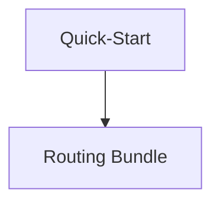

# Graph Execution Visualization

`.knowledge` can render its own maintenance flows as Mermaid diagrams.

Run from the repository root:

```bash
node .knowledge/tools/render-graph-execution.js
```

The tool writes Mermaid files here:

```txt
.knowledge/maintenance/graphs/knowledge-flow.mmd
.knowledge/maintenance/graphs/maintenance-flow.mmd
.knowledge/maintenance/graphs/agent-handoff-flow.mmd
```

## How to view the diagrams

### Option 1 — GitHub

Commit the `.mmd` files and open them on GitHub. GitHub renders Mermaid diagrams in Markdown, so you can also paste the graph into a fenced Mermaid block:

````md

````

### Option 2 — VS Code

Install any Mermaid preview extension and open the `.mmd` files.

### Option 3 — local inspector

Run:

```bash
node .knowledge/tools/serve-inspector.js
```

Use the local URL printed by the tool. This is useful for screenshots/GIFs.

## Why this is useful

The diagrams show the operational graph, not the application runtime graph:

```txt
Quick-Start → ingest → sync → wiki graph → lint → routing bundle → search index → doctor → PR summary
```

This helps users understand how `.knowledge` maintains itself and gives reviewers a visual sanity check before release.
