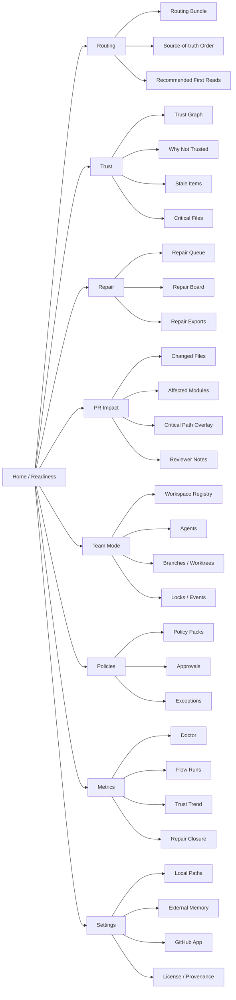
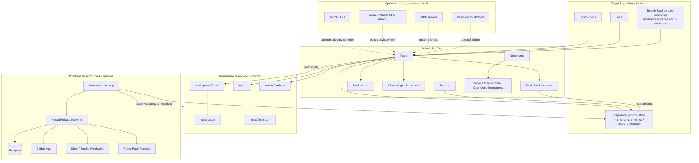
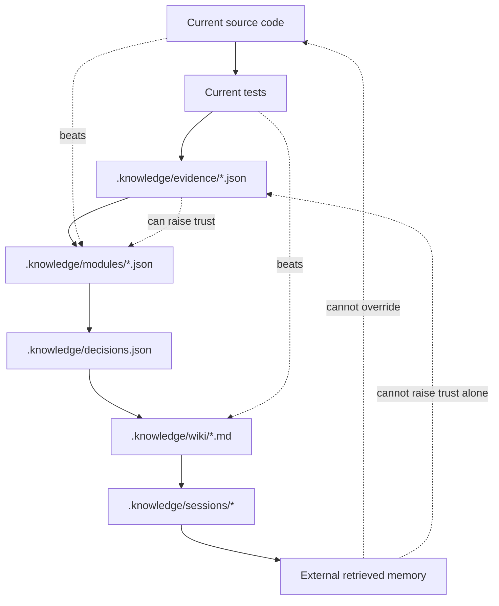
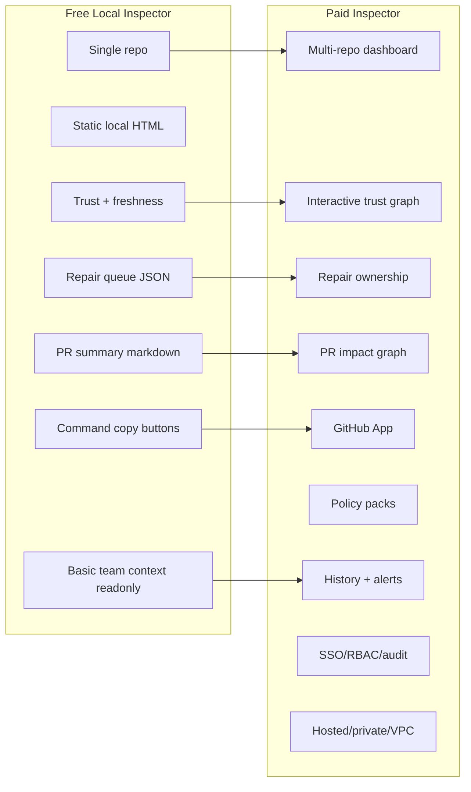
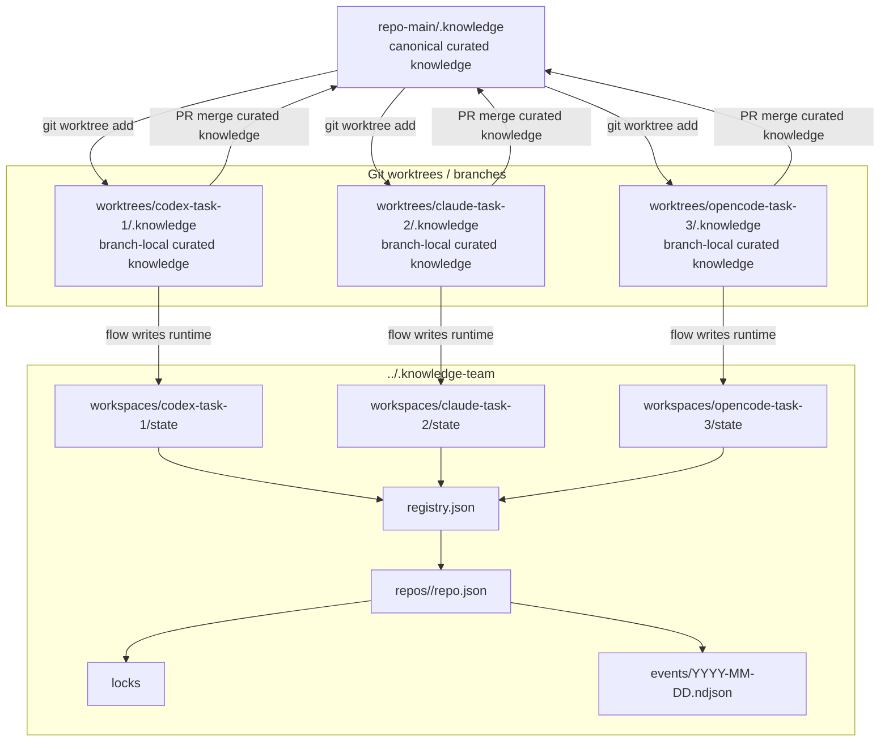
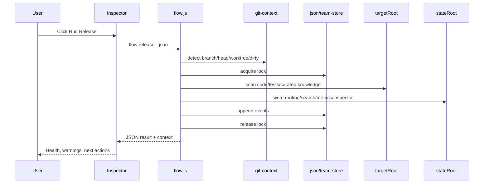
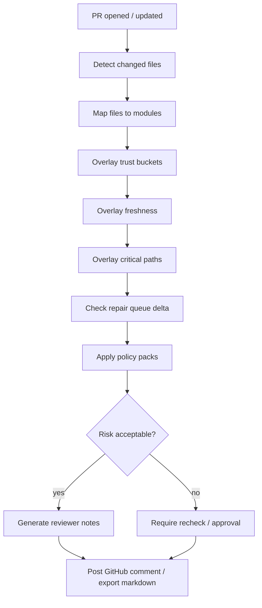
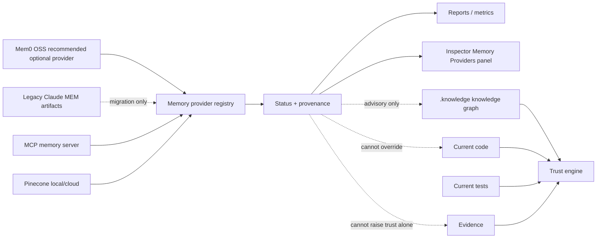
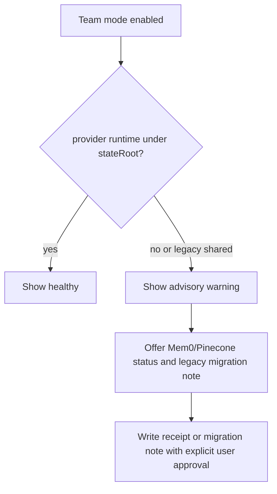
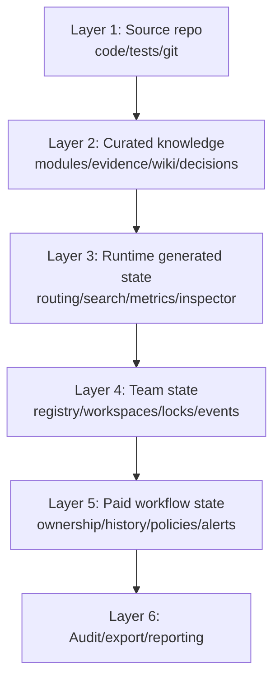

# 04 — Графы, UI, кнопки, стек и слои `.knowledge 3.2.0`

## Назначение файла

Этот файл описывает визуальную систему `.knowledge 3.2.0`: как устроены режимы, какие графы должен показывать Inspector, какие кнопки заменяют команды, какой стек нужен и как слои взаимодействуют между собой.

## Общая UI-идея

Интерфейс должен быть минималистичным, плотным и “операционным”, вдохновленным текущим стилем Pro2Pilot Inspector:

- темная/нейтральная рабочая поверхность;
- карточки с ясными статусами;
- graph-first center;
- правый detail panel;
- верхний command/action strip;
- минимум декоративности;
- максимум trust, risk, next action;
- free/paid граница встроена аккуратно: free показывает локальную правду, paid открывает командное управление.

## Информационная архитектура Inspector



## Архитектура системы



## Source-of-truth graph



Правило UI: этот граф должен быть постоянно доступен как explainability modal. Пользователь должен понимать, почему Inspector не доверяет summary без source/test evidence.

## Free vs Paid surface



## team mode / team mode topology



## Runtime flow graph



## PR impact workflow graph



## Memory provider bridge graph



Team mode warning:



## UI layout

```text
┌──────────────────────────────────────────────────────────────────────────────┐
│ Pro2Pilot .knowledge Inspector                    repo/team · branch · agent │
├───────────────┬───────────────────────────────────────────────┬──────────────┤
│ Left nav      │ Main graph / board / table                    │ Detail panel │
│               │                                               │              │
│ Readiness     │  Trust graph / PR impact / Team map           │ Selected     │
│ Routing       │                                               │ module/file  │
│ Trust         │  Filters: trusted stale suspect critical      │              │
│ Repair        │                                               │ Why not      │
│ PR Impact     │  Command strip: Run Doctor · Release · PR     │ trusted      │
│ Team Mode     │                                               │              │
│ Policies      │                                               │ Evidence     │
│ Metrics       │                                               │ Next action  │
│ Settings      │                                               │ Buttons      │
└───────────────┴───────────────────────────────────────────────┴──────────────┘
```

## Основные кнопки и режимы

### Global command strip

| Button | Free/Paid | Действие | CLI/API |
|---|---|---|---|
| `Run Doctor` | Free | Проверить health. | `doctor.js --json` |
| `Run Import` | Free | Первичный импорт/маршрутизация. | `flow.js import --json` |
| `Run Release` | Free | Полный refresh. | `flow.js release --json` |
| `Build Inspector` | Free | Пересобрать static UI. | `build-visual-inspector.js --json` |
| `Search` | Free | Локальный поиск. | `search-knowledge.js` |
| `Generate PR Summary` | Free | Markdown summary. | `generate-pr-summary.js --json` |
| `Export Debug Bundle` | Free | Local zip without secrets. | `export-debug-bundle.js --json` |
| `Enable Team Mode` | Free/Paid | Включить team mode явно. | `team-init.js`, `workspace-register.js` |
| `Analyze PR` | Paid | Interactive PR impact. | backend/GitHub App |
| `Assign Repair` | Paid | Owner/status/SLA. | paid backend |
| `Post GitHub Comment` | Paid | Publish PR impact. | GitHub App |
| `Require Approval` | Paid | Approval workflow. | paid backend |
| `Check Memory Providers` | Free/Paid | Mem0/Pinecone status and legacy migration note. | `memory-provider.js status-all --json` |

### Readiness mode

Purpose: стартовая панель.

Shows:

- doctor score;
- last flow;
- routing status;
- trust distribution;
- repair count;
- stale count;
- critical warnings;
- branch/worktree warning;
- next action.

Buttons:

- `Run Doctor`
- `Run Release`
- `Open Repair Queue`
- `Copy Agent Start Prompt`

### Routing mode

Purpose: показать, что агенту читать первым.

Shows:

- routing bundle;
- first-read path;
- module map;
- source-of-truth order;
- “why this route” explanation.

Buttons:

- `Rebuild Routing`
- `Copy First Read`
- `Open Source Files`

### Trust mode

Purpose: trust/freshness operating surface.

Shows:

- graph by module;
- buckets;
- stale overlays;
- evidence coverage;
- why-not-trusted;
- required tests.

Buttons:

- `Filter suspect`
- `Filter stale`
- `Show evidence`
- `Create repair item`
- `Copy recheck command`

### Repair mode

Purpose: actionable knowledge debt.

Free:

- local queue table;
- copy command;
- export markdown.

Paid:

- Kanban;
- owner/status/SLA;
- comments/history;
- GitHub issue sync.

Buttons:

- `Repair selected`
- `Assign owner`
- `Create GitHub issue`
- `Export queue`

### PR Impact mode

Purpose: review AI-assisted changes.

Free:

- markdown preview;
- changed files if local git data available;
- affected modules and warnings.

Paid:

- interactive graph;
- GitHub App;
- labels/checks/comments;
- policy overlays.

Buttons:

- `Analyze PR`
- `Generate reviewer notes`
- `Post comment`
- `Require recheck`

### Team Mode

Purpose: multi-worktree/multi-agent coordination.

Free:

- current mode;
- repoId;
- workspaceId;
- agentId;
- branch/head;
- lock owner;
- warnings;
- copy commands.

Paid:

- active workspaces;
- compare states;
- owner/team assignment;
- archive flow;
- GitHub PR mapping;
- history.

Buttons:

- `Team Init`
- `Register Workspace`
- `Team Status`
- `Worktree Status`
- `Lock Flow`
- `Archive Workspace`
- `Compare Workspaces`

### Policies mode

Purpose: governance overlays.

Free:

- advisory/basic policy warnings from local config.

Paid:

- policy packs;
- approval workflows;
- exceptions;
- audit export.

Buttons:

- `Apply policy pack`
- `Request approval`
- `Export policy report`

### Memory Providers mode

Purpose: external memory must be visible and subordinate.

Shows:

- Mem0 OSS status;
- Pinecone status;
- legacy Claude MEM migration warning when detected;
- MCP memory connectors;
- source path;
- version;
- license/provenance;
- isolated/shared warning;
- last sync;
- conflicts.

Buttons:

- `Check status`
- `Enable connector`
- `Disable connector`
- `Open license`
- `Export provenance`

## Стек

### Free core stack

| Layer | Recommended stack | Notes |
|---|---|---|
| CLI tools | Node.js, plain JS | Already aligned with current repo. |
| Data | JSON, Markdown, NDJSON | Human-reviewable, Git-friendly. |
| Static Inspector | HTML/CSS/vanilla JS or lightweight bundled JS | Must open locally without backend. |
| Graphs | Mermaid `.mmd`, JSON graph data | Good for docs and GitHub rendering. |
| Search | Local JSON index | No remote dependency. |
| Git helpers | Node child_process `git` wrapper | Must quote paths safely. |
| Tests | Node test runner / custom self-tests | Include temp repos/worktrees. |

### Paid Inspector stack

| Layer | Recommended stack | Reason |
|---|---|---|
| Frontend | React + TypeScript + Vite | Fast dashboard iteration. |
| Graph UI | React Flow or Cytoscape.js | Trust/PR/team graph. |
| Tables | TanStack Table | Repair queues, PRs, repos. |
| Backend | Node.js/TypeScript | Shared ecosystem with core. |
| DB | Postgres | Multi-tenant, audit, history. |
| Queue | BullMQ/Redis or managed queue | GitHub events, PR analyses, alerts. |
| Auth | OIDC/SAML provider integration | Enterprise readiness. |
| GitHub | GitHub App | PR comments/checks/labels. |
| Deployment | SaaS first, private/VPC later | Faster validation. |

### Data layers



## Function / feature / mode descriptions

| Mode | Short description |
|---|---|
| Repo-local mode | Default mode. `.knowledge` lives in one repo and writes runtime state into that repo-local `.knowledge`. |
| Team Mode / team mode | Explicit mode for multi-worktree/multi-agent work with shared team registry and separated workspace states. |
| Inspector Free | Static local surface for trust/debug/repair/search/PR preview. |
| Inspector Pro | Advanced local/solo UI, interactive graphs, local PR impact and enhanced exports. |
| Inspector Team | Multi-worktree/team dashboard, GitHub App, repair ownership, team metrics. |
| Inspector Enterprise | Multi-repo, SSO/RBAC/audit, private/VPC, advanced policy and compliance exports. |
| Memory provider interface | Mem0/Pinecone optional connectors; legacy Claude MEM advisory-only migration note; provider status appears in reports/metrics. |
| Policy Pack mode | Overlay rules for sensitive areas such as auth, billing, runtime execution and MCP tools. |
| PR Impact mode | Maps changed files to modules/trust/freshness/evidence/critical paths and reviewer notes. |
| Repair mode | Converts stale/suspect knowledge into queue items and, in paid, owned team work. |

## Минимальный UI DoD для 3.2.0

- Home/readiness view works.
- Trust graph/table works.
- Repair queue works.
- Routing bundle view works.
- PR summary preview works.
- Team mode panel works.
- Command center exists.
- Memory Providers panel exists.
- All buttons either execute through explicit local runner or copy exact command.
- Free/payed locked actions are clearly labeled, not hidden.
- Static local Inspector still works without server.
- Paid UI can be scaffolded separately without breaking core.

