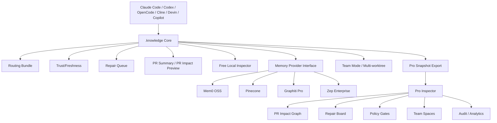
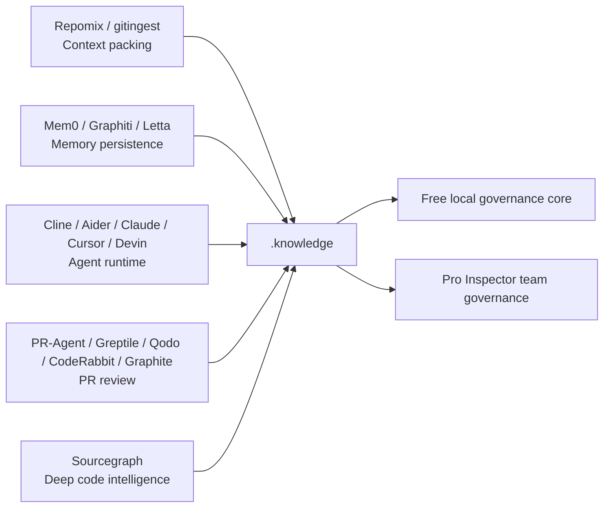
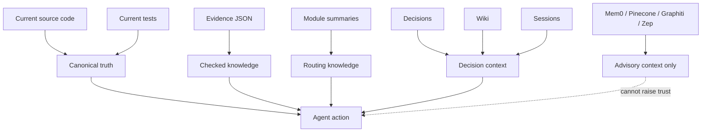
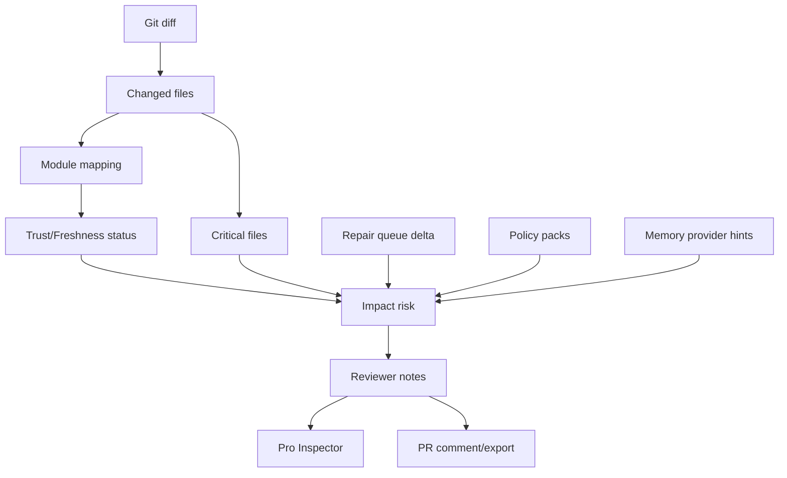
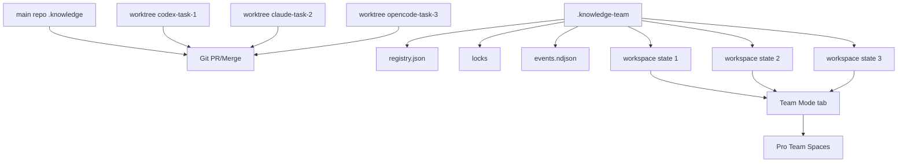

# 05 — UI, stack, layers and graphs after competitive analysis

## Design principle

The Inspector must not feel like a generated HTML report. It must feel like a minimal repo cockpit.

```txt
Button-first, evidence-first, local-first.
```

The user should be able to answer in under 30 seconds:

```txt
What does the agent know?
What is trusted?
What is stale?
What needs repair?
What PR impact exists?
Which memory providers are enabled?
Which worktree/agent is active?
What button should I press next?
```

## Free Inspector layout

```txt
┌──────────────────────────────────────────────────────────────────────────────┐
│ .knowledge Inspector 3.2.0       Repo mode · No cloud · No telemetry         │
│ Repo: pro2pilot/knowledge        Branch: main · Doctor 100/100              │
├───────────────┬──────────────────────────────────────────────────────────────┤
│ Overview      │  Trust  Freshness  Repair  PR Impact  Memory  Team          │
│ Command Center│ ┌────────┐ ┌────────┐ ┌────────┐ ┌────────┐               │
│ Routing       │ │ 8 safe │ │ 2 stale│ │ 3 open │ │ 1 warn │               │
│ Trust Ledger  │ └────────┘ └────────┘ └────────┘ └────────┘               │
│ Freshness     │                                                              │
│ Repair Queue  │ Next actions                                                 │
│ PR Impact     │ [Run Doctor] [Refresh Release] [Review PR Impact]            │
│ Memory        │ [Toggle Mem0] [Team Status] [Export Debug Bundle]            │
│ Team Mode     │                                                              │
│ Pro Preview   │ Repair Queue                                                  │
└───────────────┴──────────────────────────────────────────────────────────────┘
```

## Pro Inspector layout

```txt
┌──────────────────────────────────────────────────────────────────────────────┐
│ Pro Inspector             Org: Acme      PRs 12 · Repairs 31 · Policies 4   │
├───────────────┬──────────────────────────────────────────────────────────────┤
│ Dashboard     │ Team governance cockpit                                      │
│ Repos         │ ┌────────┐ ┌────────┐ ┌────────┐ ┌────────┐               │
│ PR Impact     │ │ PR risk│ │ Repair │ │ Policy │ │ Memory │               │
│ Repair Board  │ └────────┘ └────────┘ └────────┘ └────────┘               │
│ Team Spaces   │                                                              │
│ Policies      │ Active PR impact reviews                                     │
│ Memory Gov    │ Changed files → modules → trust → criticality → policy       │
│ Audit         │                                                              │
│ Analytics     │ Team Spaces                                                  │
└───────────────┴──────────────────────────────────────────────────────────────┘
```

## Layer graph



## Competitive layer graph



## Trust graph



## PR Impact graph



## Team Mode graph



## Button-first action map

| UI button | Free / Pro | Command / action |
|---|---|---|
| Run Doctor | Free | `doctor.js --json` |
| Refresh Release | Free | `flow.js release --json` |
| Review PR Impact | Free preview / Pro full | `pr-impact.js --json` or Pro graph |
| Open Repair Queue | Free / Pro | local queue / assigned board |
| Toggle Mem0 | Free | provider preview/install/disable |
| Memory Governance | Pro | fleet/provider screen |
| Compare Worktrees | Pro | team workspace compare |
| Export Debug Bundle | Free | redacted bundle |
| Export Pro Snapshot | Free → Pro | sanitized snapshot |
| Policy Review | Pro | policy gate evaluation |
| Assign Repair | Pro | board ownership |

## Implementation stack

### Free Inspector

```txt
Static HTML/CSS/vanilla JS
No external assets
Generated from local JSON
Opens as file://
Optional local server only serves same generated UI
```

### Pro Inspector

Preferred:

```txt
React + TypeScript + Vite
```

Minimum acceptable for private preview:

```txt
Dependency-light static shell with real screens, schemas, imports and build/test/lint
```

But it must not stay string-template demo shell forever.

## UI acceptance criteria

Free UI:

- all tabs render;
- all empty states render;
- all error states render;
- all buttons copy valid commands;
- no external assets;
- no local path leaks;
- team-mode data does not corrupt JSON;
- memory provider cards are truthful;
- Pro Preview is honest and non-blocking.

Pro UI:

- real navigation;
- dashboard;
- PR Impact graph;
- Repair Board;
- Team Spaces;
- Policy Gates;
- Memory Governance;
- Audit/History;
- Analytics;
- snapshot import;
- realistic demo data;
- build/test/lint pass.
