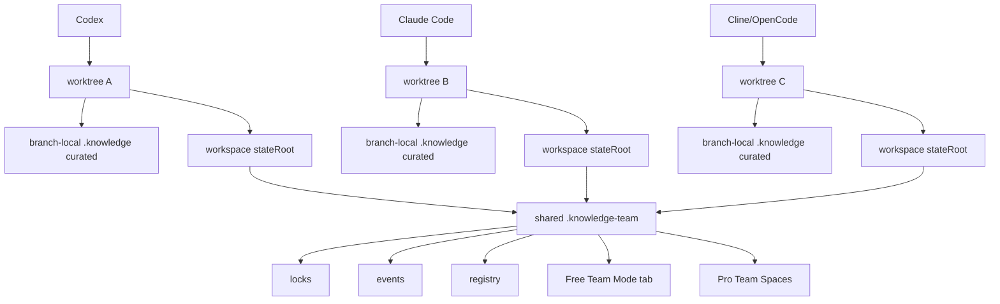

# 06 — Team Mode / Multi-worktree after competitive analysis

## Updated market position

Team Mode is still important, but not unique by itself. Competitors such as Devin-style products already move toward agent spaces, shared context and git worktree concepts.

The defensible position is:

```txt
auditable repo-local multi-worktree governance for agents
```

Not:

```txt
we invented multiple agents in worktrees
```

## What Team Mode must prove

Team Mode must prove operational safety:

- separate workspace state;
- no JSON corruption;
- no cross-contamination;
- stable repoId/workspaceId/agentId;
- locks and stale lock cleanup;
- events written;
- branch/head/dirty warnings;
- PR summary per workspace;
- default repo-local mode not broken;
- paths with spaces and Cyrillic supported;
- Inspector renders team data without corrupting JSON.

## Required commands

```bash
node .knowledge/tools/team-init.js --team-root <path> --target-root <path> --json
node .knowledge/tools/workspace-register.js --team-root <path> --target-root <path> --workspace-id <id> --agent-id <id> --json
node .knowledge/tools/team-status.js --team-root <path> --json
node .knowledge/tools/workspace-unregister.js --team-root <path> --workspace-id <id> --json
node .knowledge/tools/worktree-status.js --target-root <path> --json
node .knowledge/tools/team-pr-summary.js --team-root <path> --workspace-id <id> --json
```

## Team Mode UI split

### Free Inspector

Free tab must show:

- current mode;
- repoId;
- workspaceId;
- agentId;
- targetRoot;
- stateRoot;
- branch/head;
- dirty status;
- lock owner;
- last flow;
- warnings;
- active workspace count;
- commands for next step.

No login. No cloud. No Pro blocker.

### Pro Inspector

Pro screen must show:

- Team Spaces;
- active agents;
- workspace comparison;
- lock timeline;
- PR impact per workspace;
- repair ownership per workspace;
- policy warnings per workspace;
- archive/assign/comment actions;
- analytics across repos/workspaces.

## Updated Team Mode graph



## Self-test requirements

The following must pass from both source checkout and clean release install:

```bash
node tools/self-test-team-mode.js
node .knowledge/tools/self-test-team-mode.js
```

The self-test must include:

1. temp git repo;
2. two or more worktrees;
3. team root;
4. workspace-register for each;
5. parallel flow run;
6. exclusive lock flow;
7. build Inspector in team mode;
8. parse `inspector/data.json`;
9. verify no JSON corruption;
10. verify no state contamination;
11. verify warnings;
12. verify repo-local regression.

## Known critical failure to avoid

Never sanitize serialized JSON by regex after `JSON.stringify` if that can corrupt escaped strings.

Correct pattern:

```txt
sanitize raw data before serialization
or
parse → transform values → stringify
```

Incorrect pattern:

```txt
JSON.stringify(data).replace(pathRegex, '<local-path>')
```

This can break JSON when replacing inside escaped snippets.

## Team Mode benchmark claim

Do not market until measured:

```txt
In B8 Team Mode benchmark, N parallel worktree runs completed with zero state contamination, zero JSON corruption and 100% lock release.
```

## Pro value

Team Mode becomes paid when it moves from local status to collaboration:

| Free | Pro |
|---|---|
| current workspace status | all workspaces dashboard |
| lock owner visible | lock timeline and ownership |
| copy commands | click actions |
| PR summary local | PR impact per workspace |
| warnings | policy gates and alerts |
| single repo | multi-repo team spaces |
